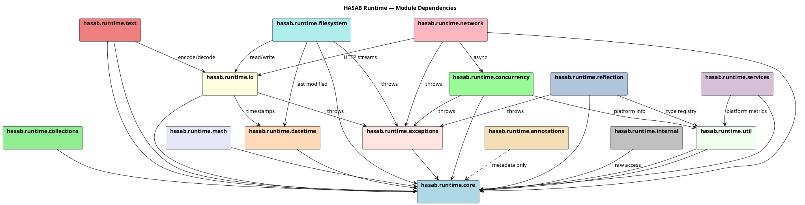

# HASAB Runtime & Standard Library - UML Diagrams

PlantUML diagrams documenting the HASAB runtime architecture.

---

## 1. Class Diagram — All 14 Modules

```plantuml
@startuml HASAB_Class_Diagram
skinparam linetype ortho
skinparam classAttributeIconSize 0
title HASAB Runtime & Standard Library — Class Diagram

package "hasab.runtime.core" {
  abstract class HsObject {
    +getType(): HsType
    +toString(): HsString
    +equals(other: HsObject): HsBool
    +hashCode(): HsInt
    +clone(): HsObject
    +isNull(): HsBool
  }
  class HsString {
    -value: String
    +length(): HsInt
    +charAt(index: HsInt): HsChar
    +substring(start: HsInt, end: HsInt): HsString
    +toUpperCase(): HsString
    +toLowerCase(): HsString
    +trim(): HsString
    +split(delimiter: HsString): HsArray
    +contains(other: HsString): HsBool
    +startsWith(prefix: HsString): HsBool
    +endsWith(suffix: HsString): HsBool
    +indexOf(other: HsString): HsInt
    +replace(target: HsString, replacement: HsString): HsString
    +toCharArray(): HsArray
    +isEmpty(): HsBool
    +reverse(): HsString
  }
  class HsInt {
    -value: long
    +add(other: HsInt): HsInt
    +subtract(other: HsInt): HsInt
    +multiply(other: HsInt): HsInt
    +divide(other: HsInt): HsInt
    +modulo(other: HsInt): HsInt
    +negate(): HsInt
    +abs(): HsInt
    +compareTo(other: HsInt): HsInt
    +toFloat(): HsFloat
    +toString(): HsString
    +isEven(): HsBool
    +isOdd(): HsBool
  }
  class HsFloat {
    -value: double
    +add(other: HsFloat): HsFloat
    +subtract(other: HsFloat): HsFloat
    +multiply(other: HsFloat): HsFloat
    +divide(other: HsFloat): HsFloat
    +negate(): HsFloat
    +abs(): HsFloat
    +ceil(): HsInt
    +floor(): HsInt
    +round(): HsInt
    +isNaN(): HsBool
    +isInfinite(): HsBool
    +compareTo(other: HsFloat): HsInt
    +toString(): HsString
    +toInt(): HsInt
  }
  class HsChar {
    -value: char
    +isLetter(): HsBool
    +isDigit(): HsBool
    +isWhitespace(): HsBool
    +toUpperCase(): HsChar
    +toLowerCase(): HsChar
    +toInt(): HsInt
    +toString(): HsString
    +compareTo(other: HsChar): HsInt
  }
  class HsBool {
    -value: boolean
    +and(other: HsBool): HsBool
    +or(other: HsBool): HsBool
    +not(): HsBool
    +toString(): HsString
    +toInt(): HsInt
  }
  class HsArray {
    -elements: Object[]
    +length(): HsInt
    +get(index: HsInt): HsObject
    +set(index: HsInt, value: HsObject): void
    +add(element: HsObject): void
    +remove(index: HsInt): HsObject
    +contains(element: HsObject): HsBool
    +indexOf(element: HsObject): HsInt
    +slice(start: HsInt, end: HsInt): HsArray
    +map(fn: HsObject): HsArray
    +filter(fn: HsObject): HsArray
    +reduce(fn: HsObject, init: HsObject): HsObject
    +forEach(fn: HsObject): void
    +sort(fn: HsObject): HsArray
    +reverse(): HsArray
    +isEmpty(): HsBool
    +toList(): HsList
  }
  HsObject <|-- HsString
  HsObject <|-- HsInt
  HsObject <|-- HsFloat
  HsObject <|-- HsChar
  HsObject <|-- HsBool
  HsObject <|-- HsArray
}

package "hasab.runtime.collections" {
  class HsList {
    -elements: ImmutableList
    +length(): HsInt
    +get(index: HsInt): HsObject
    +add(element: HsObject): HsList
    +remove(index: HsInt): HsList
    +contains(element: HsObject): HsBool
    +indexOf(element: HsObject): HsInt
    +slice(start: HsInt, end: HsInt): HsList
    +map(fn: HsObject): HsList
    +filter(fn: HsObject): HsList
    +reduce(fn: HsObject, init: HsObject): HsObject
    +forEach(fn: HsObject): void
    +sort(fn: HsObject): HsList
    +reverse(): HsList
    +prepend(element: HsObject): HsList
    +append(element: HsObject): HsList
    +concat(other: HsList): HsList
    +isEmpty(): HsBool
    +toMutable(): HsMutableList
  }
  class HsMutableList {
    -elements: MutableList
    +length(): HsInt
    +get(index: HsInt): HsObject
    +set(index: HsInt, value: HsObject): void
    +add(element: HsObject): void
    +remove(index: HsInt): HsObject
    +contains(element: HsObject): HsBool
    +indexOf(element: HsObject): HsInt
    +clear(): void
    +sort(fn: HsObject): void
    +reverse(): void
    +addAll(other: HsList): void
    +isEmpty(): HsBool
    +toImmutable(): HsList
  }
  class HsMap {
    -entries: ImmutableMap
    +size(): HsInt
    +get(key: HsObject): HsObject
    +containsKey(key: HsObject): HsBool
    +containsValue(value: HsObject): HsBool
    +keys(): HsList
    +values(): HsList
    +entries(): HsList
    +put(key: HsObject, value: HsObject): HsMap
    +remove(key: HsObject): HsMap
    +merge(other: HsMap): HsMap
    +forEach(fn: HsObject): void
    +isEmpty(): HsBool
    +toMutable(): HsMutableMap
  }
  class HsMutableMap {
    -entries: MutableMap
    +size(): HsInt
    +get(key: HsObject): HsObject
    +put(key: HsObject, value: HsObject): void
    +remove(key: HsObject): HsObject
    +containsKey(key: HsObject): HsBool
    +containsValue(value: HsObject): HsBool
    +keys(): HsList
    +values(): HsList
    +putAll(other: HsMap): void
    +clear(): void
    +isEmpty(): HsBool
    +toImmutable(): HsMap
  }
  class HsSet {
    -elements: ImmutableSet
    +size(): HsInt
    +contains(element: HsObject): HsBool
    +add(element: HsObject): HsSet
    +remove(element: HsObject): HsSet
    +union(other: HsSet): HsSet
    +intersection(other: HsSet): HsSet
    +difference(other: HsSet): HsSet
    +isSubsetOf(other: HsSet): HsBool
    +isEmpty(): HsBool
    +toList(): HsList
    +toMutable(): HsMutableSet
  }
  class HsMutableSet {
    -elements: MutableSet
    +size(): HsInt
    +contains(element: HsObject): HsBool
    +add(element: HsObject): void
    +remove(element: HsObject): void
    +clear(): void
    +addAll(other: HsSet): void
    +isEmpty(): HsBool
    +toList(): HsList
    +toImmutable(): HsSet
  }
  class HsStack {
    -elements: Deque
    +push(element: HsObject): void
    +pop(): HsObject
    +peek(): HsObject
    +size(): HsInt
    +isEmpty(): HsBool
    +contains(element: HsObject): HsBool
    +clear(): void
    +toList(): HsList
  }
  class HsQueue {
    -elements: Deque
    +enqueue(element: HsObject): void
    +dequeue(): HsObject
    +peek(): HsObject
    +size(): HsInt
    +isEmpty(): HsBool
    +contains(element: HsObject): HsBool
    +clear(): void
    +toList(): HsList
  }
  HsObject <|-- HsList
  HsObject <|-- HsMutableList
  HsObject <|-- HsMap
  HsObject <|-- HsMutableMap
  HsObject <|-- HsSet
  HsObject <|-- HsMutableSet
  HsObject <|-- HsStack
  HsObject <|-- HsQueue
}

package "hasab.runtime.io" {
  class HsIO {
    +readLine(): HsString
    +readLine(prompt: HsString): HsString
    +write(value: HsObject): void
    +writeLine(value: HsObject): void
    +writeError(value: HsObject): void
    +read(): HsString
    +readAll(): HsString
    +readFile(path: HsString): HsString
    +writeFile(path: HsString, content: HsString): void
    +readBytes(path: HsString): HsArray
    +writeBytes(path: HsString, data: HsArray): void
  }
  class HsFile {
    #handle: File
    +getPath(): HsString
    +getName(): HsString
    +getExtension(): HsString
    +exists(): HsBool
    +isFile(): HsBool
    +isDirectory(): HsBool
    +size(): HsInt
    +lastModified(): HsDateTime
    +readText(): HsString
    +writeText(content: HsString): void
    +readBytes(): HsArray
    +writeBytes(data: HsArray): void
    +delete(): HsBool
    +renameTo(newPath: HsString): HsBool
    +copyTo(dest: HsString): HsFile
    +getParent(): HsFile
  }
  HsObject <|-- HsIO
  HsObject <|-- HsFile
}

package "hasab.runtime.text" {
  class HsText {
    -content: String
    +length(): HsInt
    +charAt(index: HsInt): HsChar
    +substring(start: HsInt, end: HsInt): HsText
    +split(delimiter: HsString): HsList
    +join(parts: HsList, delimiter: HsString): HsText
    +trim(): HsText
    +toUpperCase(): HsText
    +toLowerCase(): HsText
    +contains(other: HsText): HsBool
    +replace(target: HsText, replacement: HsText): HsText
    +matches(regex: HsString): HsBool
    +toHsString(): HsString
    +isEmpty(): HsBool
    +reverse(): HsText
    +format(args: HsArray): HsText
    +encode(encoding: HsString): HsArray
    +decode(data: HsArray, encoding: HsString): HsText
  }
  HsObject <|-- HsText
}

package "hasab.runtime.math" {
  class HsMath {
    +{static} abs(x: HsInt): HsInt
    +{static} abs(x: HsFloat): HsFloat
    +{static} min(a: HsInt, b: HsInt): HsInt
    +{static} max(a: HsInt, b: HsInt): HsInt
    +{static} sqrt(x: HsFloat): HsFloat
    +{static} pow(base: HsFloat, exp: HsFloat): HsFloat
    +{static} log(x: HsFloat): HsFloat
    +{static} log2(x: HsFloat): HsFloat
    +{static} log10(x: HsFloat): HsFloat
    +{static} sin(x: HsFloat): HsFloat
    +{static} cos(x: HsFloat): HsFloat
    +{static} tan(x: HsFloat): HsFloat
    +{static} asin(x: HsFloat): HsFloat
    +{static} acos(x: HsFloat): HsFloat
    +{static} atan(x: HsFloat): HsFloat
    +{static} atan2(y: HsFloat, x: HsFloat): HsFloat
    +{static} floor(x: HsFloat): HsInt
    +{static} ceil(x: HsFloat): HsInt
    +{static} round(x: HsFloat): HsInt
    +{static} random(): HsFloat
    +{static} PI: HsFloat
    +{static} E: HsFloat
  }
}

package "hasab.runtime.datetime" {
  class HsDateTime {
    -timestamp: Instant
    +now(): HsDateTime
    +of(year: HsInt, month: HsInt, day: HsInt): HsDateTime
    +of(year: HsInt, month: HsInt, day: HsInt, hour: HsInt, min: HsInt, sec: HsInt): HsDateTime
    +parse(iso: HsString): HsDateTime
    +getYear(): HsInt
    +getMonth(): HsInt
    +getDay(): HsInt
    +getHour(): HsInt
    +getMinute(): HsInt
    +getSecond(): HsInt
    +plusDays(days: HsInt): HsDateTime
    +plusHours(hours: HsInt): HsDateTime
    +plusMinutes(minutes: HsInt): HsDateTime
    +minusDays(days: HsInt): HsDateTime
    +minusHours(hours: HsInt): HsDateTime
    +diff(other: HsDateTime): HsDateTime
    +isBefore(other: HsDateTime): HsBool
    +isAfter(other: HsDateTime): HsBool
    +toIsoString(): HsString
    +toEpochSeconds(): HsInt
    +format(pattern: HsString): HsString
  }
  HsObject <|-- HsDateTime
}

package "hasab.runtime.exceptions" {
  class HsException {
    -message: String
    -cause: Throwable
    +getMessage(): HsString
    +getCause(): HsException
    +getStackTrace(): HsArray
    +toString(): HsString
  }
  class HsTypeError {
    +HsTypeError(expected: HsString, actual: HsString)
  }
  class HsValueError {
    +HsValueError(message: HsString)
  }
  class HsIndexError {
    +HsIndexError(index: HsInt, size: HsInt)
  }
  class HsKeyError {
    +HsKeyError(key: HsObject)
  }
  class HsNameError {
    +HsNameError(name: HsString)
  }
  class HsIOError {
    +HsIOError(message: HsString, path: HsString)
  }
  class HsFileNotFoundError {
    +HsFileNotFoundError(path: HsString)
  }
  class HsPermissionError {
    +HsPermissionError(path: HsString)
  }
  class HsArithmeticError {
    +HsArithmeticError(message: HsString)
  }
  class HsNotImplementedError {
    +HsNotImplementedError(feature: HsString)
  }
  class HsConcurrencyError {
    +HsConcurrencyError(message: HsString)
  }
  class HsTimeoutError {
    +HsTimeoutError(timeout: HsInt, operation: HsString)
  }
  Exception <|-- HsException
  HsException <|-- HsTypeError
  HsException <|-- HsValueError
  HsException <|-- HsIndexError
  HsException <|-- HsKeyError
  HsException <|-- HsNameError
  HsException <|-- HsIOError
  HsException <|-- HsArithmeticError
  HsException <|-- HsNotImplementedError
  HsException <|-- HsConcurrencyError
  HsException <|-- HsTimeoutError
  HsIOError <|-- HsFileNotFoundError
  HsIOError <|-- HsPermissionError
}

package "hasab.runtime.concurrency" {
  class HsThread {
    -thread: Thread
    +start(): void
    +join(): void
    +join(timeout: HsInt): HsBool
    +isAlive(): HsBool
    +getName(): HsString
    +setName(name: HsString): void
    +getId(): HsInt
    +isDaemon(): HsBool
    +setDaemon(daemon: HsBool): void
    +interrupt(): void
    +isInterrupted(): HsBool
    +sleep(ms: HsInt): void
    +{static} currentThread(): HsThread
    +{static} yield(): void
  }
  class HsLock {
    -lock: ReentrantLock
    +lock(): void
    +tryLock(): HsBool
    +tryLock(timeout: HsInt): HsBool
    +unlock(): void
    +isLocked(): HsBool
    +getHoldCount(): HsInt
    +newCondition(): HsCondition
  }
  class HsFuture {
    -future: CompletableFuture
    +get(): HsObject
    +get(timeout: HsInt): HsObject
    +isDone(): HsBool
    +isCancelled(): HsBool
    +cancel(mayInterrupt: HsBool): HsBool
    +thenApply(fn: HsObject): HsFuture
    +thenAccept(fn: HsObject): HsFuture
    +exceptionally(fn: HsObject): HsFuture
  }
  class HsExecutor {
    -executor: ExecutorService
    +submit(task: HsObject): HsFuture
    +execute(task: HsObject): void
    +shutdown(): void
    +shutdownNow(): HsList
    +isShutdown(): HsBool
    +awaitTermination(timeout: HsInt): HsBool
    +{static} newFixedThreadPool(threads: HsInt): HsExecutor
    +{static} newCachedThreadPool(): HsExecutor
    +{static} newSingleThreadExecutor(): HsExecutor
    +{static} newScheduledThreadPool(threads: HsInt): HsExecutor
  }
  HsObject <|-- HsThread
  HsObject <|-- HsLock
  HsObject <|-- HsFuture
  HsObject <|-- HsExecutor
}

package "hasab.runtime.reflection" {
  class HsReflection {
    +{static} getType(obj: HsObject): HsType
    +{static} getClassName(obj: HsObject): HsString
    +{static} getSuperclass(obj: HsObject): HsType
    +{static} getInterfaces(obj: HsObject): HsList
    +{static} getMethods(obj: HsObject): HsList
    +{static} getFields(obj: HsObject): HsList
    +{static} invoke(obj: HsObject, methodName: HsString, args: HsArray): HsObject
    +{static} getField(obj: HsObject, fieldName: HsString): HsObject
    +{static} setField(obj: HsObject, fieldName: HsString, value: HsObject): void
    +{static} isInstance(obj: HsObject, typeName: HsString): HsBool
    +{static} newInstance(typeName: HsString, args: HsArray): HsObject
  }
}

package "hasab.runtime.annotations" {
  class HsDeprecated {
    +reason: HsString
    +since: HsString
  }
  class HsOverride
  class HsInternal
  class HsPure
  class HsInline
  class HsTailRec
  class HsOperator {
    +precedence: HsInt
    +associativity: HsString
  }
  class HsOverload
  class HsSealed
  class HsVisible
  class HsJvmStatic
  class HsJvmName {
    +name: HsString
  }
}

package "hasab.runtime.services" {
  class HsVersion {
    +{static} current(): HsString
    +{static} major(): HsInt
    +{static} minor(): HsInt
    +{static} patch(): HsInt
    +{static} isAtLeast(version: HsString): HsBool
  }
  class HsProfiler {
    +{static} start(label: HsString): void
    +{static} stop(label: HsString): HsFloat
    +{static} snapshot(): HsMap
    +{static} reset(): void
    +{static} gc(): void
    +{static} memoryUsage(): HsMap
    +{static} threadCount(): HsInt
  }
}

package "hasab.runtime.internal" {
  class HsInternal {
    +{static} identityHash(obj: HsObject): HsInt
    +{static} objectSize(obj: HsObject): HsInt
    +{static} arrayCopy(src: HsArray, srcPos: HsInt, dest: HsArray, destPos: HsInt, len: HsInt): void
    +{static} defineClass(name: HsString, bytecode: HsArray): void
    +{static} unsafeGetField(obj: HsObject, fieldName: HsString): HsObject
    +{static} unsafeSetField(obj: HsObject, fieldName: HsString, value: HsObject): void
  }
}

package "hasab.runtime.util" {
  class HsPlatform {
    +{static} os(): HsString
    +{static} arch(): HsString
    +{static} javaVersion(): HsString
    +{static} cpus(): HsInt
    +{static} totalMemory(): HsInt
    +{static} freeMemory(): HsInt
    +{static} maxMemory(): HsInt
    +{static} env(name: HsString): HsString
    +{static} currentTimeMillis(): HsInt
    +{static} nanoTime(): HsInt
  }
  class HsLog {
    +{static} info(message: HsString): void
    +{static} warn(message: HsString): void
    +{static} error(message: HsString): void
    +{static} debug(message: HsString): void
    +{static} setLevel(level: HsString): void
    +{static} getLevel(): HsString
  }
  class HsConfig {
    -config: Map
    +{static} get(key: HsString): HsString
    +{static} get(key: HsString, default: HsString): HsString
    +{static} set(key: HsString, value: HsString): void
    +{static} load(path: HsString): void
    +{static} save(path: HsString): void
    +{static} keys(): HsList
  }
  class HsLocalize {
    +{static} translate(key: HsString): HsString
    +{static} translate(key: HsString, args: HsArray): HsString
    +{static} setLocale(locale: HsString): void
    +{static} getLocale(): HsString
    +{static} availableLocales(): HsList
  }
}

package "hasab.runtime.filesystem [NEW]" {
  class HsPath {
    -segments: List
    +resolve(relative: HsString): HsPath
    +resolve(other: HsPath): HsPath
    +relativize(other: HsPath): HsPath
    +normalize(): HsPath
    +getParent(): HsPath
    +getFileName(): HsString
    +getExtension(): HsString
    +isAbsolute(): HsBool
    +toAbsolute(): HsPath
    +toString(): HsString
    +startsWith(other: HsPath): HsBool
    +endsWith(other: HsString): HsBool
  }
  class HsDirectory {
    #path: java.io.File
    +list(): HsList
    +listFiles(): HsList
    +listDirs(): HsList
    +walk(): HsList
    +walk(maxDepth: HsInt): HsList
    +create(): HsBool
    +createParents(): HsBool
    +exists(): HsBool
    +delete(): HsBool
    +deleteRecursively(): HsBool
    +copyTo(dest: HsPath): HsDirectory
    +moveTo(dest: HsPath): HsDirectory
    +getPath(): HsPath
    +size(): HsInt
  }
  class HsFileWatcher {
    -directory: HsDirectory
    -callback: HsObject
    -running: boolean
    +start(): void
    +stop(): void
    +isRunning(): HsBool
    +getWatchedPath(): HsPath
  }
  class HsWatchEvent {
    -type: String
    -path: HsPath
    -timestamp: HsDateTime
    +getType(): HsString
    +getPath(): HsPath
    +getTimestamp(): HsDateTime
    +isCreate(): HsBool
    +isModify(): HsBool
    +isDelete(): HsBool
  }
  class HsTempFile {
    #tempFile: java.io.File
    +getPath(): HsPath
    +exists(): HsBool
    +delete(): HsBool
    +getPathString(): HsString
    +{static} create(): HsTempFile
    +{static} create(prefix: HsString): HsTempFile
    +{static} createInDir(dir: HsPath): HsTempFile
    +{static} createTempDir(): HsTempFile
  }
  HsObject <|-- HsPath
  HsObject <|-- HsDirectory
  HsObject <|-- HsFileWatcher
  HsObject <|-- HsWatchEvent
  HsObject <|-- HsTempFile
  HsDirectory --> HsPath : returns
  HsFileWatcher --> HsWatchEvent : emits
  HsFileWatcher --> HsDirectory : watches
}

package "hasab.runtime.network [NEW]" {
  class HsUrl {
    -uri: java.net.URI
    -url: java.net.URL
    +{static} parse(url: HsString): HsUrl
    +{static} build(scheme: HsString, host: HsString, port: HsInt, path: HsString): HsUrl
    +getScheme(): HsString
    +getHost(): HsString
    +getPort(): HsInt
    +getPath(): HsString
    +getQuery(): HsString
    +getFragment(): HsString
    +getUsername(): HsString
    +withPath(path: HsString): HsUrl
    +withQuery(query: HsString): HsUrl
    +withFragment(fragment: HsString): HsUrl
    +resolve(relative: HsString): HsUrl
    +toUri(): HsString
    +toString(): HsString
    +equals(other: HsObject): HsBool
  }
  class HsHttpRequest {
    -method: String
    -url: HsUrl
    -headers: HsMutableMap
    -body: HsArray
    -timeout: HsInt
    +{static} get(url: HsString): HsHttpRequest
    +{static} post(url: HsString, body: HsArray): HsHttpRequest
    +{static} put(url: HsString, body: HsArray): HsHttpRequest
    +{static} delete(url: HsString): HsHttpRequest
    +{static} patch(url: HsString, body: HsArray): HsHttpRequest
    +getMethod(): HsString
    +getUrl(): HsUrl
    +getHeaders(): HsMutableMap
    +getBody(): HsArray
    +getTimeout(): HsInt
    +header(name: HsString, value: HsString): HsHttpRequest
    +timeout(ms: HsInt): HsHttpRequest
    +body(body: HsArray): HsHttpRequest
    +bodyJson(json: HsString): HsHttpRequest
    +build(): HsHttpRequest
  }
  class HsHttpResponse {
    -statusCode: int
    -headers: HsMutableMap
    -body: HsArray
    +getStatusCode(): HsInt
    +getHeaders(): HsMutableMap
    +getBody(): HsArray
    +getBodyText(): HsString
    +getBodyJson(): HsString
    +isSuccess(): HsBool
    +header(name: HsString): HsString
  }
  class HsHttpClient {
    #client: HttpClient
    +execute(request: HsHttpRequest): HsHttpResponse
    +executeAsync(request: HsHttpRequest): HsFuture
    +close(): void
    +{static} create(): HsHttpClient
    +{static} create(timeout: HsInt): HsHttpClient
  }
  HsObject <|-- HsUrl
  HsObject <|-- HsHttpRequest
  HsObject <|-- HsHttpResponse
  HsObject <|-- HsHttpClient
  HsHttpClient --> HsHttpRequest : sends
  HsHttpClient --> HsHttpResponse : returns
  HsHttpClient --> HsFuture : async returns
}

@enduml
```

---

## 2. Module Dependency Diagram



---

## 3. Exception Hierarchy

```plantuml
@startuml HASAB_Exception_Hierarchy
skinparam classAttributeIconSize 0
title HASAB Exception Hierarchy

class Exception <<Java>> {
  +getMessage(): String
  +getCause(): Throwable
  +printStackTrace(): void
}

class HsException {
  +getMessage(): HsString
  +getCause(): HsException
  +getStackTrace(): HsArray
  +toString(): HsString
}

class HsTypeError {
  -expected: HsString
  -actual: HsString
  +HsTypeError(expected: HsString, actual: HsString)
}

class HsValueError {
  +HsValueError(message: HsString)
}

class HsIndexError {
  -index: HsInt
  -size: HsInt
  +HsIndexError(index: HsInt, size: HsInt)
}

class HsKeyError {
  -key: HsObject
  +HsKeyError(key: HsObject)
}

class HsNameError {
  -name: HsString
  +HsNameError(name: HsString)
}

class HsArithmeticError {
  +HsArithmeticError(message: HsString)
}

class HsNotImplementedError {
  -feature: HsString
  +HsNotImplementedError(feature: HsString)
}

class HsConcurrencyError {
  +HsConcurrencyError(message: HsString)
}

class HsTimeoutError {
  -timeout: HsInt
  -operation: HsString
  +HsTimeoutError(timeout: HsInt, operation: HsString)
}

class HsIOError {
  -path: HsString
  +HsIOError(message: HsString, path: HsString)
}

class HsFileNotFoundError {
  -path: HsString
  +HsFileNotFoundError(path: HsString)
}

class HsPermissionError {
  -path: HsString
  +HsPermissionError(path: HsString)
}

Exception <|-- HsException : extends

HsException <|-- HsTypeError
HsException <|-- HsValueError
HsException <|-- HsIndexError
HsException <|-- HsKeyError
HsException <|-- HsNameError
HsException <|-- HsArithmeticError
HsException <|-- HsNotImplementedError
HsException <|-- HsConcurrencyError
HsException <|-- HsTimeoutError
HsException <|-- HsIOError

HsIOError <|-- HsFileNotFoundError
HsIOError <|-- HsPermissionError

note bottom of HsException
  Base exception for all HASAB
  runtime errors. Maps to JVM
  Exception class.
end note

note right of HsFileNotFoundError
  File system operations
  that reference missing
  paths or directories.
end note

note right of HsTimeoutError
  Futures, locks, and I/O
  operations with deadlines.
end note

@enduml
```



---

## 4. Collections Hierarchy — Immutable vs Mutable

```plantuml
@startuml HASAB_Collections_Hierarchy
skinparam classAttributeIconSize 0
title HASAB Collections — Immutable vs Mutable Types

class HsObject {
  +getType(): HsType
  +toString(): HsString
  +equals(other: HsObject): HsBool
  +hashCode(): HsInt
}

package "Immutable Collections" #LightBlue {
  class HsList {
    +length(): HsInt
    +get(index: HsInt): HsObject
    +add(element: HsObject): HsList
    +remove(index: HsInt): HsList
    +contains(element: HsObject): HsBool
    +map(fn: HsObject): HsList
    +filter(fn: HsObject): HsList
    +reduce(fn: HsObject, init: HsObject): HsObject
    +sort(fn: HsObject): HsList
    +reverse(): HsList
    +prepend(element: HsObject): HsList
    +append(element: HsObject): HsList
    +concat(other: HsList): HsList
    +isEmpty(): HsBool
    +toMutable(): HsMutableList
  }
  class HsMap {
    +size(): HsInt
    +get(key: HsObject): HsObject
    +containsKey(key: HsObject): HsBool
    +keys(): HsList
    +values(): HsList
    +entries(): HsList
    +put(key: HsObject, value: HsObject): HsMap
    +remove(key: HsObject): HsMap
    +merge(other: HsMap): HsMap
    +isEmpty(): HsBool
    +toMutable(): HsMutableMap
  }
  class HsSet {
    +size(): HsInt
    +contains(element: HsObject): HsBool
    +add(element: HsObject): HsSet
    +remove(element: HsObject): HsSet
    +union(other: HsSet): HsSet
    +intersection(other: HsSet): HsSet
    +difference(other: HsSet): HsSet
    +isSubsetOf(other: HsSet): HsBool
    +isEmpty(): HsBool
    +toMutable(): HsMutableSet
  }
}

package "Mutable Collections" #LightGreen {
  class HsMutableList {
    +length(): HsInt
    +get(index: HsInt): HsObject
    +set(index: HsInt, value: HsObject): void
    +add(element: HsObject): void
    +remove(index: HsInt): HsObject
    +contains(element: HsObject): HsBool
    +clear(): void
    +sort(fn: HsObject): void
    +reverse(): void
    +addAll(other: HsList): void
    +isEmpty(): HsBool
    +toImmutable(): HsList
  }
  class HsMutableMap {
    +size(): HsInt
    +get(key: HsObject): HsObject
    +put(key: HsObject, value: HsObject): void
    +remove(key: HsObject): HsObject
    +containsKey(key: HsObject): HsBool
    +keys(): HsList
    +values(): HsList
    +putAll(other: HsMap): void
    +clear(): void
    +isEmpty(): HsBool
    +toImmutable(): HsMap
  }
  class HsMutableSet {
    +size(): HsInt
    +contains(element: HsObject): HsBool
    +add(element: HsObject): void
    +remove(element: HsObject): void
    +clear(): void
    +addAll(other: HsSet): void
    +isEmpty(): HsBool
    +toImmutable(): HsSet
  }
}

package "Queue-like Structures" #Lavender {
  class HsStack {
    +push(element: HsObject): void
    +pop(): HsObject
    +peek(): HsObject
    +size(): HsInt
    +isEmpty(): HsBool
    +contains(element: HsObject): HsBool
    +clear(): void
    +toList(): HsList
  }
  class HsQueue {
    +enqueue(element: HsObject): void
    +dequeue(): HsObject
    +peek(): HsObject
    +size(): HsInt
    +isEmpty(): HsBool
    +contains(element: HsObject): HsBool
    +clear(): void
    +toList(): HsList
  }
}

package "Array (Fixed-size)" #Thistle {
  class HsArray {
    +length(): HsInt
    +get(index: HsInt): HsObject
    +set(index: HsInt, value: HsObject): void
    +add(element: HsObject): void
    +remove(index: HsInt): HsObject
    +contains(element: HsObject): HsBool
    +indexOf(element: HsObject): HsInt
    +slice(start: HsInt, end: HsInt): HsArray
    +map(fn: HsObject): HsArray
    +filter(fn: HsObject): HsArray
    +reduce(fn: HsObject, init: HsObject): HsObject
    +forEach(fn: HsObject): void
    +sort(fn: HsObject): HsArray
    +reverse(): HsArray
    +isEmpty(): HsBool
    +toList(): HsList
  }
}

HsObject <|-- HsList
HsObject <|-- HsMap
HsObject <|-- HsSet
HsObject <|-- HsMutableList
HsObject <|-- HsMutableMap
HsObject <|-- HsMutableSet
HsObject <|-- HsStack
HsObject <|-- HsQueue
HsObject <|-- HsArray

' --- Conversion arrows ---
HsList ..> HsMutableList : toMutable()
HsMutableList ..> HsList : toImmutable()
HsMap ..> HsMutableMap : toMutable()
HsMutableMap ..> HsMap : toImmutable()
HsSet ..> HsMutableSet : toMutable()
HsMutableSet ..> HsSet : toImmutable()
HsArray ..> HsList : toList()
HsStack ..> HsList : toList()
HsQueue ..> HsList : toList()

note right of HsStack
  LIFO — Last In, First Out.
  Backed by Deque.
end note

note right of HsQueue
  FIFO — First In, First Out.
  Backed by Deque.
end note

note bottom of HsArray
  Fixed-size, contiguous storage.
  Supports fast indexed access.
end note

@enduml
```



---

## 5. New Module Detail — filesystem/ and network/

```plantuml
@startuml HASAB_New_Modules_Detail
skinparam classAttributeIconSize 0
skinparam linetype ortho
title HASAB Runtime — New Modules: filesystem/ and network/

' ============================================================
'  FILESYSTEM MODULE
' ============================================================

package "hasab.runtime.filesystem" as fs #PaleTurquoise {

  class HsPath {
    -segments: List<String>
    +resolve(relative: HsString): HsPath
    +resolve(other: HsPath): HsPath
    +relativize(other: HsPath): HsPath
    +normalize(): HsPath
    +getParent(): HsPath
    +getFileName(): HsString
    +getExtension(): HsString
    +isAbsolute(): HsBool
    +toAbsolute(): HsPath
    +toString(): HsString
    +startsWith(other: HsPath): HsBool
    +endsWith(other: HsString): HsBool
  }

  class HsDirectory {
    #path: java.io.File
    +list(): HsList
    +listFiles(): HsList
    +listDirs(): HsList
    +walk(): HsList
    +walk(maxDepth: HsInt): HsList
    +create(): HsBool
    +createParents(): HsBool
    +exists(): HsBool
    +delete(): HsBool
    +deleteRecursively(): HsBool
    +copyTo(dest: HsPath): HsDirectory
    +moveTo(dest: HsPath): HsDirectory
    +getPath(): HsPath
    +size(): HsInt
  }

  class HsFileWatcher {
    -directory: HsDirectory
    -callback: HsObject
    -running: boolean
    -pollInterval: long
    +start(): void
    +stop(): void
    +isRunning(): HsBool
    +getWatchedPath(): HsPath
  }

  class HsWatchEvent {
    -type: EventType
    -path: HsPath
    -timestamp: HsDateTime
    +getType(): HsString
    +getPath(): HsPath
    +getTimestamp(): HsDateTime
    +isCreate(): HsBool
    +isModify(): HsBool
    +isDelete(): HsBool
  }

  enum EventType {
    CREATE
    MODIFY
    DELETE
  }

  class HsTempFile {
    #tempFile: java.io.File
    +getPath(): HsPath
    +exists(): HsBool
    +delete(): HsBool
    +getPathString(): HsString
    +{static} create(): HsTempFile
    +{static} create(prefix: HsString): HsTempFile
    +{static} createInDir(dir: HsPath): HsTempFile
    +{static} createTempDir(): HsTempFile
  }

  ' --- Relationships within filesystem ---
  HsFileWatcher --> HsDirectory : watches
  HsFileWatcher --> HsWatchEvent : emits on change
  HsWatchEvent --> EventType : has
  HsWatchEvent --> HsPath : references
  HsDirectory --> HsPath : getPath()
  HsTempFile ..> HsPath : getPath()
}

' ============================================================
'  NETWORK MODULE
' ============================================================

package "hasab.runtime.network" as net #LightPink {

  class HsUrl {
    -uri: java.net.URI
    -url: java.net.URL
    +{static} parse(url: HsString): HsUrl
    +{static} build(scheme: HsString, host: HsString, port: HsInt, path: HsString): HsUrl
    +getScheme(): HsString
    +getHost(): HsString
    +getPort(): HsInt
    +getPath(): HsString
    +getQuery(): HsString
    +getFragment(): HsString
    +getUsername(): HsString
    +withPath(path: HsString): HsUrl
    +withQuery(query: HsString): HsUrl
    +withFragment(fragment: HsString): HsUrl
    +resolve(relative: HsString): HsUrl
    +toUri(): HsString
    +toString(): HsString
    +equals(other: HsObject): HsBool
  }

  class HsHttpRequest {
    -method: String
    -url: HsUrl
    -headers: HsMutableMap
    -body: HsArray
    -timeout: HsInt
    +{static} get(url: HsString): HsHttpRequest
    +{static} post(url: HsString, body: HsArray): HsHttpRequest
    +{static} put(url: HsString, body: HsArray): HsHttpRequest
    +{static} delete(url: HsString): HsHttpRequest
    +{static} patch(url: HsString, body: HsArray): HsHttpRequest
    +getMethod(): HsString
    +getUrl(): HsUrl
    +getHeaders(): HsMutableMap
    +getBody(): HsArray
    +getTimeout(): HsInt
    +header(name: HsString, value: HsString): HsHttpRequest
    +timeout(ms: HsInt): HsHttpRequest
    +body(body: HsArray): HsHttpRequest
    +bodyJson(json: HsString): HsHttpRequest
    +build(): HsHttpRequest
  }

  class HsHttpResponse {
    -statusCode: int
    -headers: HsMutableMap
    -body: HsArray
    +getStatusCode(): HsInt
    +getHeaders(): HsMutableMap
    +getBody(): HsArray
    +getBodyText(): HsString
    +getBodyJson(): HsString
    +isSuccess(): HsBool
    +header(name: HsString): HsString
  }

  class HsHttpClient {
    #client: java.net.http.HttpClient
    +execute(request: HsHttpRequest): HsHttpResponse
    +executeAsync(request: HsHttpRequest): HsFuture
    +close(): void
    +{static} create(): HsHttpClient
    +{static} create(timeout: HsInt): HsHttpClient
  }

  enum HttpMethod {
    GET
    POST
    PUT
    DELETE
    PATCH
  }

  ' --- Relationships within network ---
  HsHttpClient --> HsHttpRequest : sends
  HsHttpClient --> HsHttpResponse : returns (sync)
  HsHttpClient ..> HsFuture : returns (async)
  HsHttpRequest --> HsUrl : targets
  HsHttpRequest --> HttpMethod : uses method
  HsHttpRequest --> HsMutableMap : carries headers
  HsHttpResponse --> HsMutableMap : exposes headers
}

' ============================================================
'  CROSS-MODULE BRIDGES
' ============================================================

fs ..> net : HsFileWatcher can
       trigger network sync

HsHttpClient ..> HsFuture : wraps in concurrency
HsHttpClient ..> HsException : throws on failure

@enduml
```
